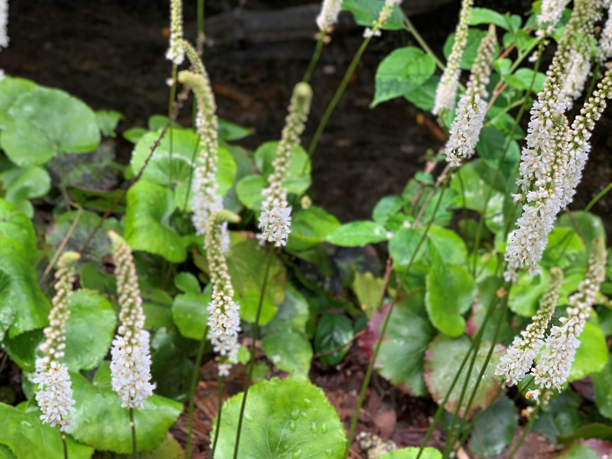
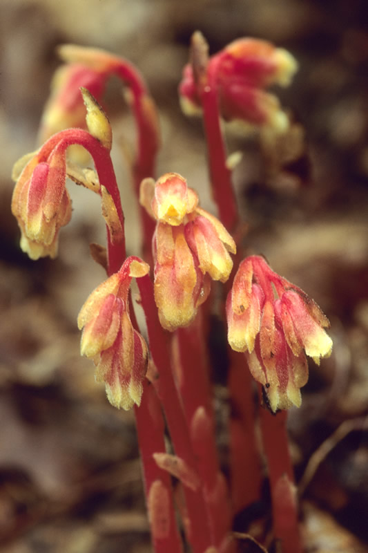
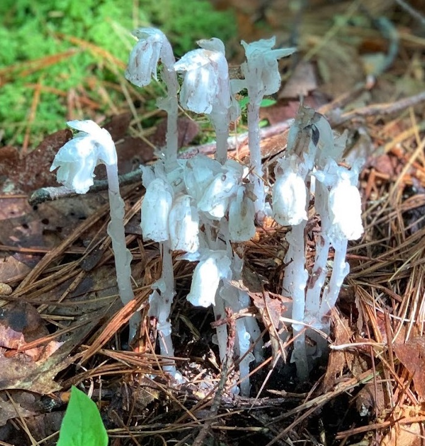

```{r setup, include=FALSE}

knitr::opts_chunk$set(echo=FALSE,
                      message=FALSE,
                      warning=FALSE)

library(papaja)

papaja::r_refs(file="dixon.bib")

options(knitr.kable.NA="")

```


# *Galax unceolata*

```{r galax1}
#| fig.cap = "*Galax unceolata* in bloom.",
#| out.width = "50%",
#| fig.align = "center"


```

## Common names; Wandflower, Wandplant, and Beetleweed.

*Galax unceolata* is an herbaceous perennial plant native to North America, growing mainly in the Appalachian Mountains up to 1500 meters (4921 feet) in elevation. This species is the sole representative of the plant family Diapensiaceae. This plant grows mainly in the understory of shaded forests and is composed of a rosette of leathery cardioid (heart) shaped. The leaves are serrated along the margin and will turn brown during the winter. Galax flowers in late sprignt to early summer along a single spike-like stem. Each flower is composed of five petals and are white in color. The fruit are capsules containing multiple seeds. The leaves persist throughout the year and are commonly harvested and used as an herbal remedy for cuts and kidney ailments. Although Galax is secure in the Southern Appalachian region, there are concerns about overharvesting particularly in the northern extent of its range.[@predny.2005]

Further reading: [Galax (*Galax unceolata*): An Annotated Bibliography](https://www.srs.fs.usda.gov/pubs/gtr/gtr_srs087.pdf)


# *Monotropa hypopitys*

```{r hypopitys}
#| fig.cap = "*Monotropa hypositys* flowers. Photo by Hugh and Carol Nourse.",
#| out.width = "50%",
#| fig.align = "center"


```

## Common names; Dutchman's Pipe, false beech-drops, pinesap, and yellow bird's-nest

*Monotropa hypopitys* is an herbaceous perennial plant that grows to height between 10 and 35 cm. In North America, *M hypopitys* flowers from May to October in mature, moist, shaded forests often under pine trees ("hypo" - under, "pitys" - pine). Each plant produces a single unbranched inflorescence that are analogous (similar in function but different evolution) to adventitious roots that appear pale yellowish-white to red-tinged. This is because the plant is parasitic in nature and obtains its nutrients from photosynthetic trees  connected via fungal mycorrhizal networks. The leaves, or bracts, are scale-like and cover most of the inflorescence. The flowers of this plant emerge as pendants and become erect when the fruit matures. Plants that flower in the summer tend to be yellow and sparsely hairy, while those blooming in autumn tend to be red and densely hairy. It is proposed that the summer blooms are self-pollinating. [@hypopitys] 

Further reading: [*Monotropa hypopitys* - Pinesap, Dutchman's Pipe](https://www.fs.fed.us/wildflowers/beauty/mycotrophic/monotropa_hypopitys.shtml)


# *Monotropa uniflora*

```{r uniflora}
#| fig.cap = "*Monotropa uniflora* flowers.",
#| out.width = "50%",
#| fig.align = "center"


```

## Common names; Indian Pipe and Ghost Plant

*Monotropa uniflora* is an uncommon perennial wildflower that grows to height between 10 and 30 cm. *M uniflora* blooms in early summer through early autumn in mature, moist, shaded forests. This plant is entirely translucent white while sometimes appearing in a pale pinkish-hue. This is because the plant is parasitic in nature and obtains its nutrients from photosynthetic trees (commonly Beech; *Fagus sp.*) connected via fungal mycorrhizal networks. The leaves that arise directly from the peduncle (flower stalk) are scale-like and can be flecked black. As the name suggests (*M uniflora*), this plant has single-flowers that emerge as pendants (pointed downward). Once the flower matures it erects perpendicular to the stalk. The fruits are capsules with seeds that release through slits along the length of the capsule. The flowers can persist following seed dispersal however the flesh may become desiccated and look brown or black. [@uniflora]
 
Further reading: [*Monotropa uniflora* - Ghost Plant, Indian Pipe](https://www.fs.fed.us/wildflowers/beauty/mycotrophic/monotropa_uniflora.shtml)


# References

