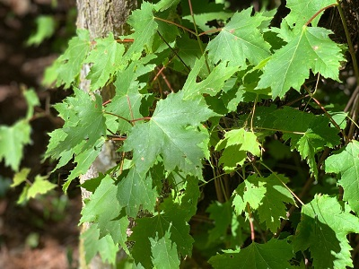
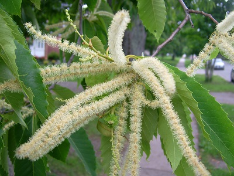
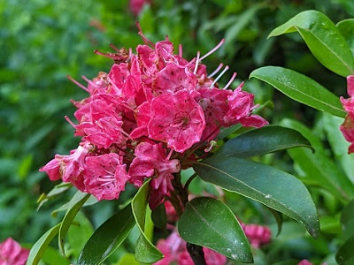
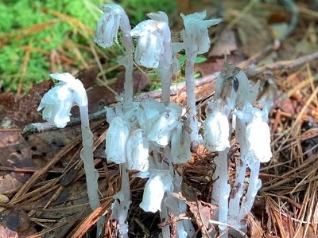
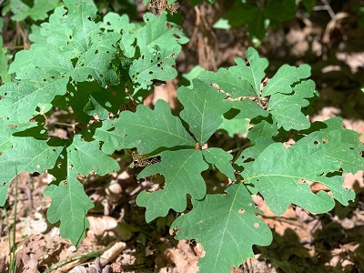

```{r setup, include=FALSE}

knitr::opts_chunk$set(echo=FALSE,
                      message=FALSE,
                      warning=FALSE)

library(papaja)
library(rsconnect)
library(packrat)

papaja::r_refs(file="dixon.bib")

options(knitr.kable.NA="")

```

# *Acer x freemanii*

```{r maple}
#| fig.cap = "*Acer* leaves (left), close-up (right).",
#| out.width = "50%",
#| fig.align = "center",
#| fig.show="hold"




```

## Common names; Freeman maple and Autumn blaze maple

*Acer x freemanii* is a naturally occuring hybrid between *Acer rubrum* (Red Maple) and *Acer saccharinum* (Silver Maple). This tree in named after the hybridizer Oliver M. Freeman of the U.s. National Arboretum. The fall foliage of this tree colors orange-red and is often used as a street tree in urban areas. This fall foliage can last for several weeks before shedding for the winter. In winter, the usually smooth, thin, gray bark furrows with age. This tree can grow up to 60 feet tall and 40 feet wide in the foliage. As a full sun and partial shade tolerant plant, it is easily grown in well-fdraining moist, organic-rich, and slightly acidic soils such as those in Dixon. [@acer; @acer2]

Further reading; [*Acer x freemanii*](https://plants.ces.ncsu.edu/plants/acer-x-freemanii/), [*Acer x freemanii*](https://en.wikipedia.org/w/index.php?title=Acer_%C3%97_freemanii&oldid=1049718728)

# *Castanea dentata*

```{r cast}
#| fig.cap = "*Castanea dentata* leaves (left), flowers on catkins (right).",
#| out.width = "50%",
#| fig.align = "center",
#| fig.show="hold"




```

## Common names; American Chestnut and Chestnut

*Castenea dantata*, was once prolific across the Eastern U.S., has faced rapid decline of it's historic range following introduction of pathogenic fungus in New York City in 1904. The chestnut blight, introduced by imported Chinese chestnuts (*Castanea mollissima*), prevents American chestnuts from reaching maturity. Nowadays, reprouting trees from stumps can grow up to 20 feet tall and produce some nuts before succumbing to the blight. Work by the American Chestnut Society is being done to produce blight resistant trees by hybridizing American chestnut with Chinese chestnut. [@ACF]

Healthy American chestnuts can grow to be 50-75 feet tall and an equal width of foliage. The leaves can grow between 4 and 9 inches long at a width of 1.5 to 3 inches. They are dark green leaves with coarse-toothed margin and bristly tips. In fall the leaves turn a yellow-gold. Chestnuts flower from June to July, producing yellowish-white flowers on catkins (a cylindrical flower cluster). [@castenea]

Further reading; [American Chestnut Foundation](https://acf.org), [*Castanea dentata*](https://plants.ces.ncsu.edu/plants/castanea-dentata/)

# *Galax unceolata*

```{r galax1}
#| fig.cap = "*Galax unceolata* in bloom.",
#| out.width = "50%",
#| fig.align = "center"

knitr::include_graphics("galax1.png")
```

## Common names; Wandflower, Wandplant, and Beetleweed.

*Galax unceolata* is an herbaceous perennial plant native to North America, growing mainly in the Appalachian Mountains up to 1500 meters (4921 feet) in elevation. This species is the sole representative of the plant family Diapensiaceae. This plant grows mainly in the understory of shaded forests and is composed of a rosette of leathery cardioid (heart) shaped. The leaves are serrated along the margin and will turn brown during the winter. Galax flowers in late sprignt to early summer along a single spike-like stem. Each flower is composed of five petals and are white in color. The fruit are capsules containing multiple seeds. The leaves persist throughout the year and are commonly harvested and used as an herbal remedy for cuts and kidney ailments. Although Galax is secure in the Southern Appalachian region, there are concerns about overharvesting particularly in the northern extent of its range.[@galax]

Further reading: [Galax (*Galax unceolata*): An Annotated Bibliography](https://www.srs.fs.usda.gov/pubs/gtr/gtr_srs087.pdf)


# *Gaylussacia spp.*

```{r gayluss}
#| fig.cap = "Foliage of Gaylussacia in a sun fleck.",
#| out.width = "50%",
#| fig.align = "center",


```

## Common names; huckleberry and dangleberry

*Gaylussacia* is a genus of flowering plants that contains about 50 different species in the Ericaceae family. These deciduous or evergreen shrubs (depending on species) are a common component of oak-heath forests and are native the the Americas. These plant species are used as food by Lepidoptera (butterflies and moths) larvae, including *Coleophora gaylussaciella* which feeds exclusively on these plants. The fruits are edible to humans and are dark purple-black colored berries similar to blueberries (*Vacciunium spp.*). [@gaylussacia]

Further reading: [*Gaylussacia baccata* — black huckleberry](https://www.fs.fed.us/wildflowers/beauty/mycotrophic/monotropa_hypopitys.shtml)


# *Iris sanguinea*

```{r iris}
#| fig.cap = "*Iris sanguinea* in late bloom",
#| out.width = "50%",
#| fig.align = "center",
#| fig.show="hold"


```

## Common names; Japanese Iris and Siberian Iris

*Iris sanguinea* is native to eastern Asia, hence the common names, but have since been naturalized to temperate regions across the globe. Many plant of this genus are thought to be poisonous if ingested, especially the roots, as such they are resistant to deer and rabbits. Iris can grow in virtually any hardiness region of the U.S. but particularly enjoys deep meadows, near riparian areas, and on forest edges. The soils for this plant should be well draining, with slight acidity and plenty of organic matter. It prefers full sun but is tolerant of partial shade. It flowers between May and July, producing blue, white, or purple-lavendar showy blooms. The flower goes to seed in July through September following flower blooms. The seeds, themselves, are ellipsoidal capsules with with flat seeds. [@iris; @iris2]

Further reading;[*Iris sanguinea*](https://plants.ces.ncsu.edu/plants/iris-sanguinea/),
[Iris sanguinea - Donn. ex Hornem.](https://pfaf.org/user/Plant.aspx?LatinName=Iris+sanguinea)

# *Kalmia latifolia*

```{r kalmia}
#| fig.cap = "*Kalmia latifolia* bark (top left), fallen white flowers (top right), and tree with foliage in a sun fleck (bottom)",
#| out.width = "50%",
#| fig.align = "center",
#| fig.show="hold"





```

## Common names; Calico bush, Ivy bush, Laurel, Mountain ivy, Mountain laurel, Sheepkill, and Spoonwood

*Kalmia latifolia* is a broadleaf evergreen shrub that branches often into a thicket and sometimes as a small tree with a crooked trunk. Laurel flowers in late April to July for several weeks in a range of colors from pink or purple/lavender to white. Each flower is cup-shaped with 4-5 petals and begin fruiting in Fall. Fruits are capsules that are brown or copper in color and available from September to October. Laurel is highly poisonous causing skeletal muscle and cardiac muscle function, as well as nerve function. Laurel is commonly mistaken for *Rhododendron catawbiense* due to similar leaf structure, laurel has smaller leaves and rhododendron have larger leaves. Likewise, as laurel ages the bark begins to peel off in long strips. The two are otherwise similar in growth requirements, i.e. full sun or partial shade, acidic soils with good drainage and high organic matter. [@kal; @kal2; @kal3]

Further reading;[*Kalmia latifolia*](https://www.wildflower.org/plants/result.php?id_plant=KALA), [WILDFLOWERS 101: MOUNTAIN LAUREL AND RHODODENDRON](https://www.smokiesinformation.org/news/wildflowers-101-mountain-laurel-and-rhododendron.html#:~:text=The%20laurel%20has%20the%20smaller,leaves%20droop%20and%20curl%20back.), [*Kalmia latifolia*](https://plants.ces.ncsu.edu/plants/kalmia-latifolia/)

# *Laetiporous sulphureus*

```{r chicken}
#| fig.cap = "*Galax unceolata* in bloom.",
#| out.width = "50%",
#| fig.align = "center"


```

## Common names; Chicken-of-the-woods, Crab-of-the-woods, Sulphur polypore, and sulphur shelf

# *Liriodendron tulipifera*

```{r tulippop}
#| fig.cap = "*Galax unceolata* in bloom.",
#| out.width = "50%",
#| fig.align = "center"


```

## Common names; Blue-poplar, Tulip-poplar, Tulip tree, Yellow-poplar, Yellow wood

# *Monotropa uniflora*

```{r uniflora}
#| fig.cap = "*Monotropa uniflora* flowers.",
#| out.width = "50%",
#| fig.align = "center"


```

## Common names; Indian Pipe and Ghost Plant

*Monotropa uniflora* is an uncommon perennial wildflower that grows to height between 10 and 30 cm. *M uniflora* blooms in early summer through early autumn in mature, moist, shaded forests. This plant is entirely translucent white while sometimes appearing in a pale pinkish-hue. This is because the plant is parasitic in nature and obtains its nutrients from photosynthetic trees (commonly Beech; *Fagus sp.*) connected via fungal mycorrhizal networks. The leaves that arise directly from the peduncle (flower stalk) are scale-like and can be flecked black. As the name suggests (*M uniflora*), this plant has single-flowers that emerge as pendants (pointed downward). Once the flower matures it erects perpendicular to the stalk. The fruits are capsules with seeds that release through slits along the length of the capsule. The flowers can persist following seed dispersal however the flesh may become desiccated and look brown or black. [@uniflora]
 
Further reading: [*Monotropa uniflora* - Ghost Plant, Indian Pipe](https://www.fs.fed.us/wildflowers/beauty/mycotrophic/monotropa_uniflora.shtml)


# *Onoclea struthiopteris*

```{r shutfern}
#| fig.cap = "*Galax unceolata* in bloom.",
#| out.width = "50%",
#| fig.align = "center"


```

## Common names; Fiddlehead fern, Ostrich-feather fern, Ostrich fern, Shuttlecock fern

# *Patera clarki*

```{r snaily}
#| fig.cap = "*Galax unceolata* in bloom.",
#| out.width = "50%",
#| fig.align = "center"


```

## Common names; Dwarf proud globe 

# *Pinus echinata*

```{r shpine}
#| fig.cap = "*Galax unceolata* in bloom.",
#| out.width = "50%",
#| fig.align = "center"


```

## Common names; Arkansas soft pine, Old field pine, Shortleaf pine, Shortleaf yellow pine, Shortstraw pine, Southern yellow pine, and Yellow pine

# *Pinus rigida*

```{r rigida, echo=FALSE}
#| fig.cap = "*Pinus rigida* bark (Left). Cone life stages (Right), photo courtesy of C. N. Elliot.",
#| out.width = "50%",
#| fig.align = "center",
#| fig.show="hold"


knitr::include_graphics("p rigida bark.jpg")

knitr::include_graphics("pitch pine cones.png")


```

## Common names; Pitch pine

*Pinus rigida* is mainly found in the southern areas of the northeastern United States. These trees are found in environments other species may find unfavorable (i.e. acidic, sandy, and low nutrient soils). The needles of this tree come in fascicles of three, grow to a length of 6-13 cm (2.25-5 inches), and are often slightly twisted. The cones of this tree are serotinous, meaning, they need to be exposed to an internal temperature of 100°C/212°F and can survive external temperatures as high as 421°C/790°F. The trunks of pitch pine are usually straight and covered in large, thick, irregular plates of bark. The thick bark provides an adaptation against fire by insulating the sensitive cambium layer from heat. It also has a remarkable regenerative ability, should it be damaged by cuts or fire, it can resprout using epicormic shoots (grow from the bark). Pitch pine is a pioneer species in abandoned agricultural or pasture land and is replaced by hardwoods, spruce, or other pines in the absence of disturbance. [@rigida]


Further reading: [*Pinus rigida*](https://www.fs.fed.us/database/feis/plants/tree/pinrig/all.html#Cone%20survival%20and%20seedling%20establishment:)


# *Quercus robur*

```{r engoak}
#| fig.cap = "*Galax unceolata* in bloom.",
#| out.width = "50%",
#| fig.align = "center"



```

## Common names; English Oak, Oak, Truffle Oak

# *Quercus rubra*

```{r redoaks}
#| fig.cap = "*Galax unceolata* in bloom.",
#| out.width = "50%",
#| fig.align = "center"


knitr::include_graphics("redoak.jpg")

```

## Common names; Common red oak, Gray oak, Eastern red oak, Mountain red oak, and Northern red oak


# References


